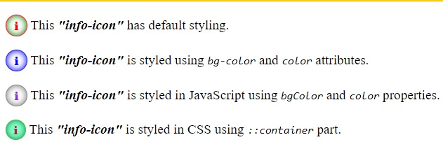

# info-icon component


This is an info-icon component. A standard custom web component written in pure vanilla JS, so it could be used in any framework.

> With the package you will find a complete functional example (**example.html**)<br>

## Usage:
Use it like any standard tag:
- In html: `<info-icon color="blue" bg-color="blue"></info-icon>`
- In JS: `document.createElement("info-icon")`

## Attributes:
- `bg-color`: ex `<info-icon bg-color="blue"></info-icon>`, this attribute determines the `color` of an `inset` `box-shadow`: `box-shadow: bg-color 0 0 0.5em inset;`.

- `color`: ex `<info-icon color="blue"></info-icon>`, this attribute determines the `color` of an letter `i` shown inside the element.

## Properties:
- `bgColor`: ex `elem.bgColor = "red"`, this is the property that is associated with the attribute `bg-color`.

- `color`: ex `elem.color = "green"`, this is the property that is associated with the attribute `color`.


## Styling:
1. Use the attributes `bg-color` and `color`:
   ```html
   <p><info-icon color="blue" bg-color="blue"></info-icon> This "info-icon" is styled using bg-color and color attributes.</p>
   ```

2. Or use the properties `bgColor` and `color` in JavaScript:
   ```js
      const elem = document.querySelector("info-icon");
      elem.bgColor = "#777";
      elem.color = "blueviolet";
   ```
3. Or use the defined `part` on the component: the component is just a standard `<span part="container">i</span>:`
   ```css
   info-icon::part(container) {
      background-color: aquamarine;
      color: brown;
      border: none;
   }
   ```
